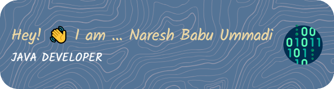

<!-- **NareshUmmadi/NareshUmmadi** is a ✨ _special_ ✨ repository because its `README.md` (this file) appears on your GitHub profile.

Here are some ideas to get you started:

- 🔭 I’m currently working on ...
- 🌱 I’m currently learning ...
- 👯 I’m looking to collaborate on ...
- 🤔 I’m looking for help with ...
- 💬 Ask me about ...
- 📫 How to reach me: ...
- 😄 Pronouns: ...
- ⚡ Fun fact: ...
-->

  
 

<h3 align="center">👨🏼‍💻 A Passionate Full Stack Software Developer</h3>

### 💫 About Me

- 👀 Currently looking for full-time positions as a **Fullstack Java Software Developer**, available to start immediately.

- 🤝 Open to work as a **Fullstack Java Software Developer**, **Front-End Developer**, **Back-End Developer**, **Java Developer**.

- 👨‍💻 All of my projects are available at [https://github.com/NareshUmmadi?tab=repositories](https://github.com/NareshUmmadi?tab=repositories)

- 💬 Ask me about **Spring Framework, Java, Angular, ReactJS, Javascript, Typescript, HTML5, CSS3**

- 📫 How to reach me **nareshummadi53@gmail.com**

- ⚡ Fun fact **In the end, it's all about that one semicolon. 😅😅 – Anonymous Developer**

### 🏆 GitHub Trophies

 

### 🌐 Socials

### 🚀 Languages and Tools I Use

### 📊 GitHub Stats

### ✍️ Random Dev Quote

### 🔝 Top Contributed Repo

